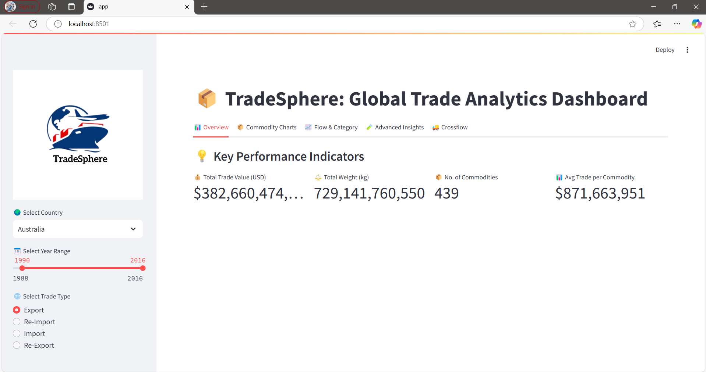
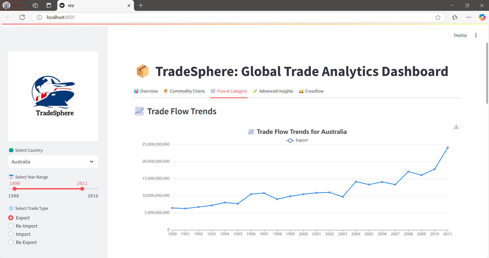
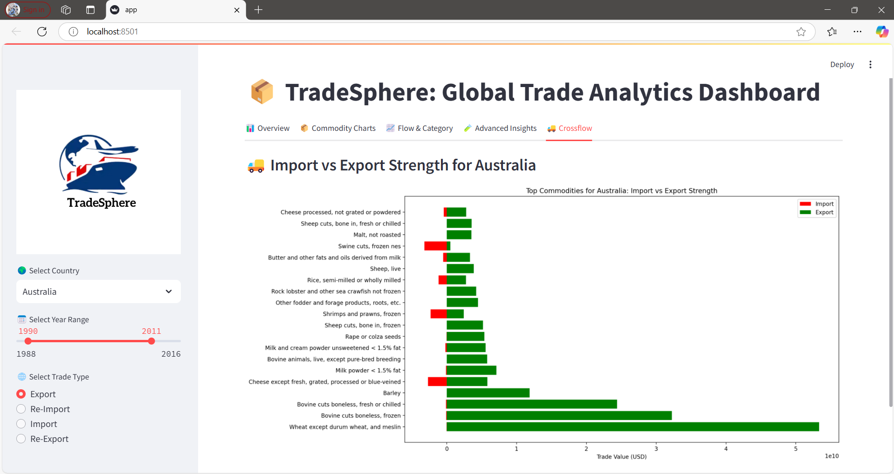

# 🌍 TradeSphere — Global Trade Analytics Dashboard

An interactive Streamlit dashboard to explore and analyze global import-export flows, commodity trends, and trade strengths across countries and years.

---

## 🚀 Features

- 🌍 **Country-wise Trade Analysis** — Select any country and analyze trade.
- 📅 **Year Range Filtering** — Focus on a specific time period dynamically.
- 📦 **Trade Type Filtering** — Choose Import, Export, Re-Import, Re-Export flows.
- 📈 **Trade Flow Trends** — Dynamic line charts for different trade types.
- 🥧 **Trade Value by Category** — Visual insights with Pie Charts and Treemaps.
- 🔥 **Advanced Insights** — Heatmap, Pareto Chart (Top 20 Commodities), and Bubble Chart (Trade Value vs Weight).
- 🚚 **Import vs Export Strength** — Analyze top commodities based on trade flow balance.
- 🎨 **Custom Branding** — Includes logo and background image integration.

---

## 🛠 Technologies Used

- **Python**
- **Streamlit**
- **Pandas**
- **Matplotlib**
- **Seaborn**
- **Altair**
- **Streamlit-Echarts**

---

## 📸 Screenshots

| Dashboard Home       | Trade Flow Trends          | Crossflow                 |
| :------------------- | :------------------------- | :------------------------ |
|  |  |  |

---

## ⚙️ How to Run Locally

```bash
# Clone the repository
git clone https://github.com/mohammad-adil-shaik/Projects/Global_trade_analytics.git


# Navigate into the project
cd Projects/Global_trade_analytics

# (Optional) Create and activate virtual environment

# Install required packages
pip install -r requirements.txt

# Run the app
streamlit run app.py
```

---

## 📂 Project Structure

```
/assets/           # Logo and background images
app.py            # Main Streamlit app
Raw_data.csv       # Trade data file
README.md          # Project overview
```

---

## 📢 Project Status

- ✅ Basic Analytics Dashboard Completed
- 🚀 Future Enhancements Planned:
  - Predictive trade analytics
  - Country vs Country comparison
  - Animated year-wise trade evolution

---

## 🔖 Badges (Optional)

```markdown


```
